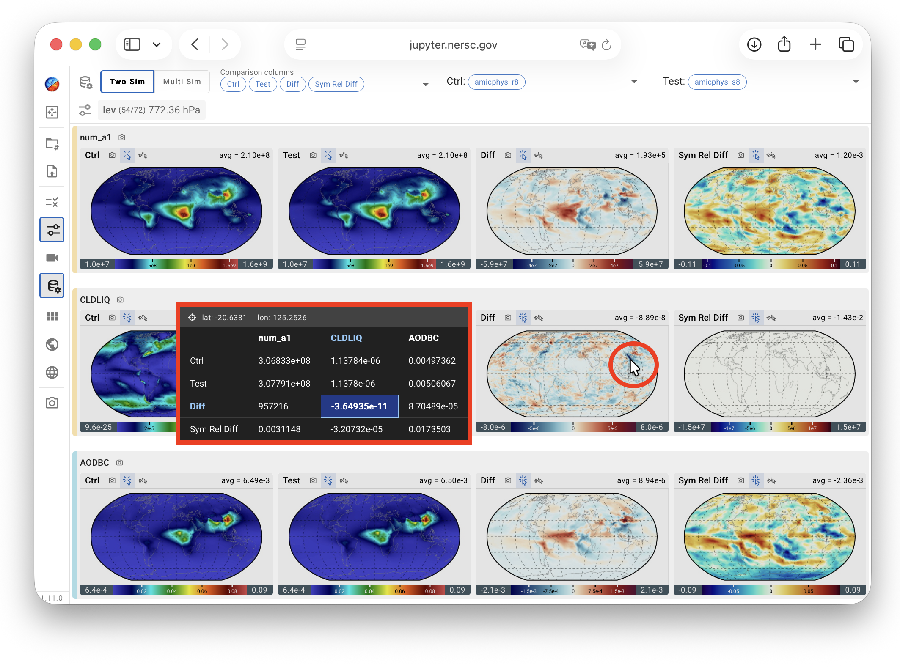
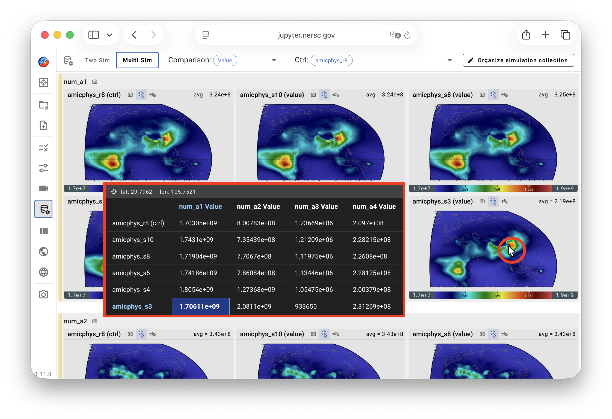
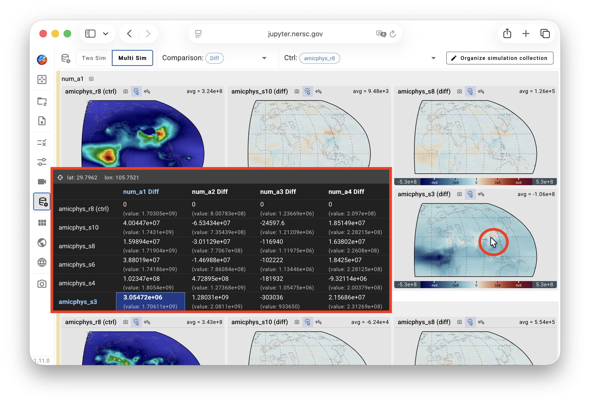

# The Cursor Probe in QuickCompare {#cursor-probe}

Starting with version 1.11.0, QuickCompare provides a Cursor Probe for inspecting data values at the cursor location. Two probe modes are available:

| Icon | Mode | Description |
|------|------|-------------|
|  | Hover Mode | Updates continuously as the cursor moves over contour plots in the viewport. |
|  | Click Mode | Updates only when the user clicks a location in a contour plot. This mode may provide better responsiveness when working with very large datasets. |

In both modes, information associated with the cursor location is displayed in an
**Information Panel**. The latitude and longitude appear at the top, followed by
a data table. The data corresponding to the plot under the cursor is
highlighted using boldface text and a different background color.

The organization of the table differs between the two-simulation and
multi-simulation comparison modes.

## Two-simulation mode

In the two-simulation mode, the table in the Information Panel presents the
user-selected **comparison metrics**—such as Ctrl, Test, Diff, and Rel Diff—as
rows and up to five **output variables** as columns. If more than five variables
have been selected, the table includes the first five currently displayed in the
viewport.

{ width="100%" }

## Multi-simulation mode

In the multi-simulation mode,
when the comparison type is set to **Value**, the table in the Information Panel
presents variable values, with rows corresponding to simulations and columns
corresponding to variables. The table cell corresponding to the plot under the cursor
is highlighted.

{ width="100%" }

When the comparison type is set to **Diff**, **Rel Diff**, or **Sym Rel Diff**,
the table presents the differences as the primary values and shows the original
values in gray within parentheses. As in the "Value" comparison, rows correspond
to simulations, columns correspond to variables, and the cell corresponding to
the plot under the cursor is highlighted.

{ width="100%" }

## Activating the probe

The Cursor Probe is inactive by default and can be activated by clicking either the
Hover Mode or Click Mode icon in any viewport panel.
These icons are available in all views for convenient access.
However, the probe's activate/inactive state applies to the entire viewport
and is shared across all views. As a result, the Cursor Probe cannot be enabled
for some views (variables) while remaining disabled for others.
