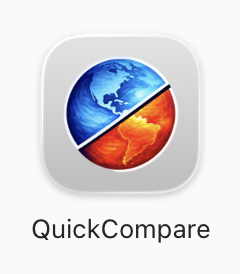

# What is QuickCompare?

{ width="18%", align=right }

QuickCompare is an offshoot of [QuickView](/guides/quickview/index.md),
an interactive tool for inspecting data files produced by Earth system simulations.
Instead of presenting a single simulation,
QuickCompare contrasts two or more simulations that
use the same horizontal mesh (and hence the same connectivity information).
Plots can be shown for the user-selected physical quantities themselves
as well as differences and relative differences between simulations.
Like [QuickView](/guides/quickview/index.md),
QuickCompare is designed to present multiple variables simultaneously
to help identify potential relationships.

Useful resources: see [linked page](./getting_started).

## Key Features

- Intuitive, minimalist interface tailored for Earth system modeling.
- Physical quantities displayed together with differences and/or relative differences between simulations.
- Multi-variable visualization.
- Persistent sessions—pick up where you left off.
- Support for EAM v2, v3, and upcoming v4 output formats
  as well as the E3SM land model ELM's input and output files
  on ne*pg2 grids.

## Project Background

The lead developer of QuickCompare is
[Will Dunklin](https://www.kitware.com/will-dunklin/)
at [Kitware](https://www.kitware.com/).
Other key contributors include
Sebastien Jourdain, Patrick O'Leary, Berk Geveci, and Dan Lipsa at [Kitware](https://www.kitware.com/) as well as
Hui Wan and Kai Zhang at
[Pacific Northwest National Laboratory](https://www.pnnl.gov/atmospheric-climate-and-earth-sciences-division).

QuickCompare is a product of an interdisciplinary collaboration supported by
the U.S. Department of Energy Office of Science’s
[Advanced Scientific Computing Research (ASCR)](https://www.energy.gov/science/ascr/advanced-scientific-computing-research)
and
[Biological and Environmental Research (BER)](https://www.energy.gov/science/ber/biological-and-environmental-research)
via the
[Scientific Discovery through Advanced Computing (SciDAC](https://www.scidac.gov/))
program.

The development of QuickCompare used resources of the National Energy Research Scientific Computing Center
([NERSC](https://www.nersc.gov/)), a U.S. Department of Energy User Facility.

{ width="75%", align=center }
