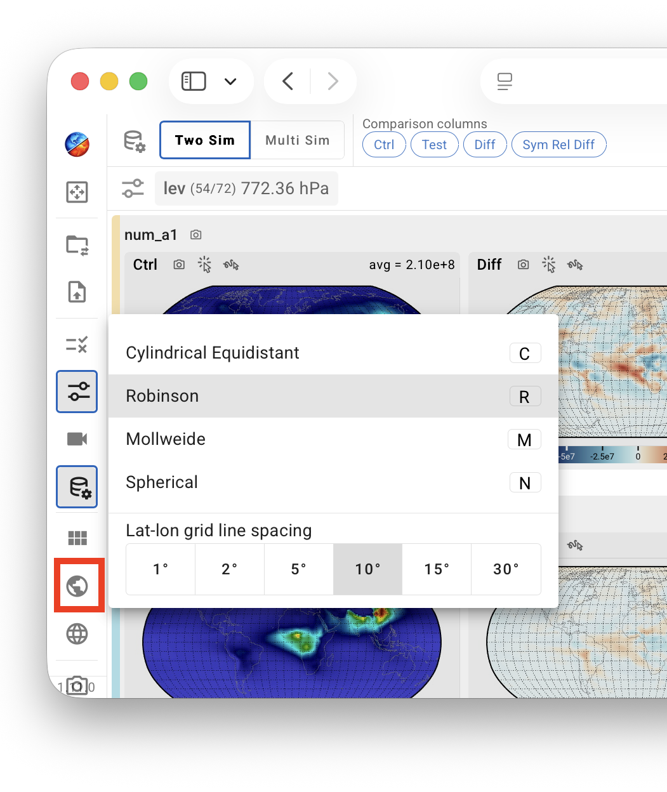

# Map-Related Features

## Map projection {#map-projections}

{ width="60%", align=right }

The map projection used for the contour plots can be changed through the mini-menu opened by clicking the Earth icon in the vertical toolbar. The projection can also be selected using the following keyboard shortcuts:

- `C`: cylindrical equidistant;
- `R`: Robinson;
- `M`: Mollweide;
- `N`: spherical.

The bottom section of the same mini-menu allows the user to adjust the spacing of the latitude–longitude grid lines shown on the map.

## Geographical region {#geographical-region}

The geographical region displayed in the contour plots—defined by its latitude and longitude bounds—can be adjusted using the range sliders in the latitude–longitude cropping panel. The panel is opened by clicking the Earth-grid icon in the vertical toolbar.

A set of text boxes and arrow buttons located between the latitude and longitude range sliders allows the user to specify the geographical location at which the map is centered.

{ width="100%" }

