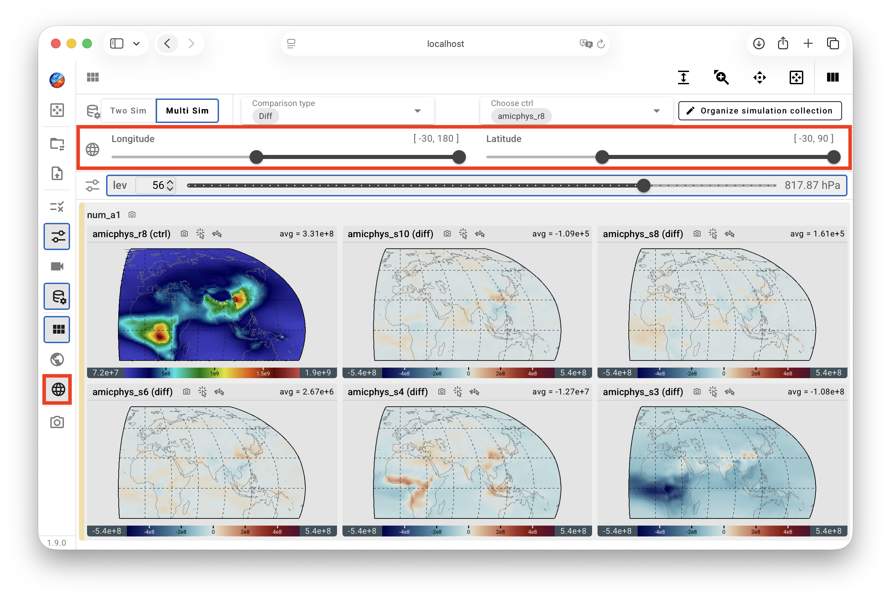
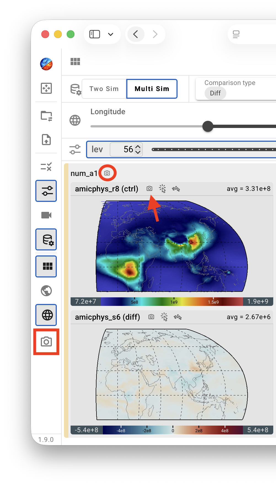

# Miscellaneous Features 

QuickCompare includes various convenient features tailored to Earth system modelers' analysis workflow.

[[toc]]

<!--
## Cursor probe {#cursor-probe}

Starting in version 2.8.3, QuickView provides a Cursor Probe for inspecting data values at the cursor location. Two modes are available:

| Icon | Mode | Description |
|------|------|-------------|
|  | Hover Mode | Updates continuously as the cursor moves over contour plots in the viewport. |
|  | Click Mode | Updates only when the user clicks a location in a contour plot. This mode may provide better responsiveness when working with very large datasets. |

{ width="30%", align=right }

In both modes, information associated with the cursor location is displayed in
an **Information Panel**, as shown in the screenshot here.
The latitude and longitude of the cursor location are shown at the top,
followed by the name and value of the variable in the current view, as well as
the names and values of the other variables displayed in the viewport.
If a variable has non-horizontal dimensions, the value shown in the Information Panel
is the value at the cursor-selected lat-lon location in the currently data slice. 

{ width="50%", align=right }

The Cursor Probe is inactive by default and can be activated by clicking either the
Hover Mode or Click Mode icon in any viewport panel.
These icons are available in all views for convenient access.
However, the probe's activate/inactive state applies to the entire viewport
and is shared across all views. As a result, the Cursor Probe cannot be enabled
for some views (variables) while remaining disabled for others.
-->

## Choosing map projection and geographical region {#maps}

The map projection used for the contour plots can be changed using the mini menu
activated by a click on the Earth icon in the vertical tool bar—or by keyboard shortcuts:

- `C` for cylindrical equidistant,
- `R` for Robinson, and
- `M` for Mollweide.

The geographical region, i.e., the latitude and longitude bounds to be displayed in the contour plots,
can be adjusted using the sliders in the lat/lon cropping panel activated by a click on
the Earth grid icon in the vertical toolbar.

{ width="100%" }

## Saving the visualization {#save-vis}

In addition to [saving the state](/guides/quickcompare/file_selection#state-files)
of the current session so that the analysis can be resumed later,
QuickCompare provides three ways for the user to save the visualization as images:

{ width="50%", align=right }

- A click on the **camera icon at the end of the vertical toolbar** saves the entire
  viewport—in its current layout—to the local computer as a `.png` file with a filename
  starting with `Viewport`.

- A click on the **camera icon next to the variable name** in the upper-left corner of
  each row of plots in the [two-simulation mode](./two-sim_comparison#rows) mode—or
  each section of plots in the [multi-simulation mode](./multi-sim_comparison#sections) mode—
  saves that row or section of plots as a `.png` file.
  The file name starts with the variable name;
  dimension names and indices are appended when relevant.

- A click on the **camera icon above each plot**
  saves that single plot (view) as a `.png` file. 

Given the large amount of views (plots) typically involved in a QuickCompare session
resulting from loading multiple simulations and variables as well as the different
metrics (i.e., physical quantities themselves and various differences),
QuickCompare currently does not offer animation download,
but we, the developers, are open to user feedback and suggestions in that regard. 
