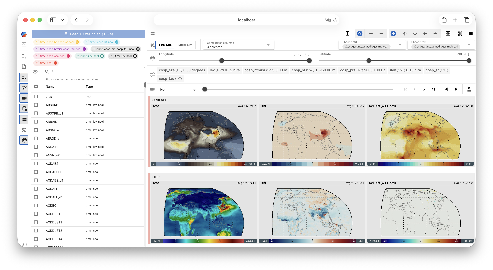
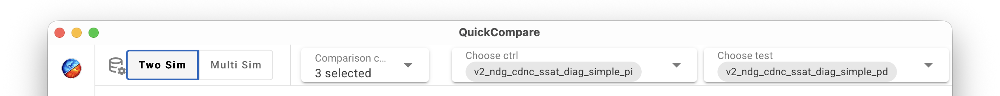
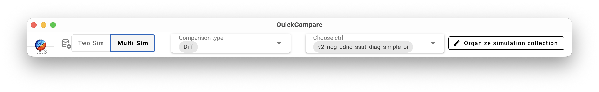

# QuickCompare's Graphical UI

{ width="100%" }

## UI components

QuickCompare's UI closely resembles the [UI in QuickView](/guides/quickview/ui_overview):

- The **Viewport** displays contour plots on global or regional maps.

- Various **Control Panels** are provided for choosing and arranging the
  contents displayed in the Viewport as well as the properties of the contour plots.
  The control panels can be collapsed (hidden)
  or expanded (shown) by clicking on their corresponding icons in the
  toolbar or by using [keyboard shortcuts](/guides/quickview/shortcuts).

- The **Main Toolbar** placed vertically on the left side of the UI
  contains various buttons that either activate pop-up menus on click
  or serve as toggles for showing or hiding Control Panels.
  The toolbar is shown in a collapsed mode by default, but
  will change into an expanded mode if the user clicks on the
  QuickCompare icon at the top of the toolbar or press the
  `H` key on the keyboard.

The only differences between the QuickCompare UI and the QuickView UI have
to do with the fact that QuickCompare displays multiple simulations and,
optionally, their differences.

{ width="5%", align=right }

A **Comparison** button is included in the Main Toolbar,
and the corresponding control panel shows different contents
depending on whether the user has chosen a two-simulation comparison mode or
a multi-simulation (ensemble) comparison mode.
Contents in the viewport are organized differently in these two modes.

{ width="100%" }
{ width="100%" }

## Keyboard shortcuts

Keyboard shortcuts are the same as in [QuickView](/guides/quickview/shortcuts),
except that an additional shortcut, the space key,
can be used for expanding or hiding the Comparison Control Panel.
