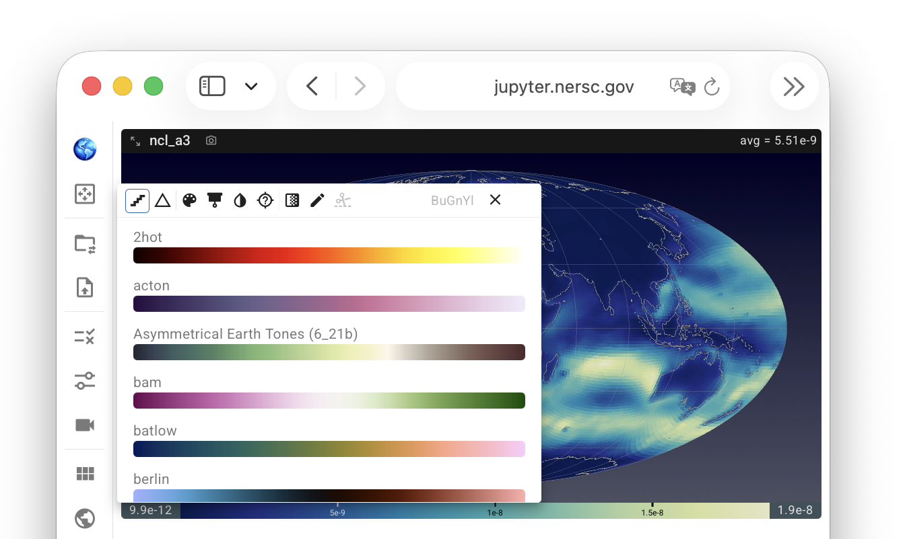
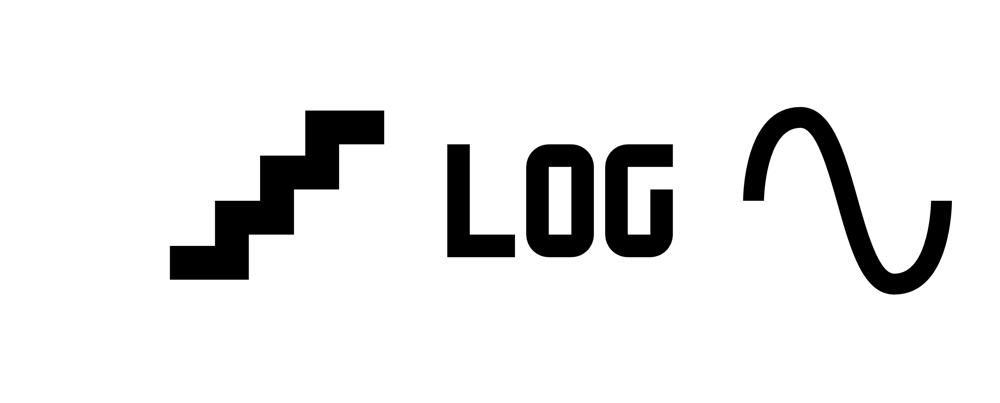
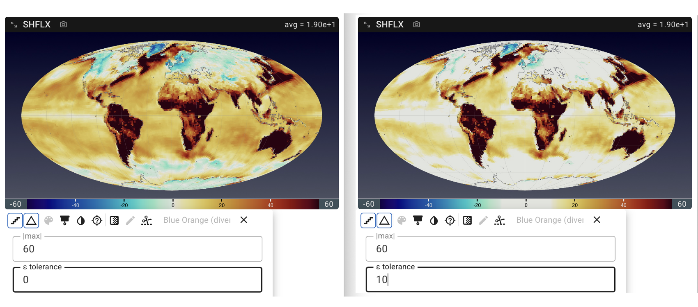

# Customizing Individual Views

Each view in the viewport (i.e., each contour plot shown on a global or regional map)
can be customized individually by clicking the associated colorbar.
The click brings up a small control panel like in the screenshot here,
allowing the user to control various properties of the mapping between
the variable values and the contour colors.
Only one panel can be open at a time — opening one automatically closes any other.

{ width="80%" }

Each control panel contains up to three sections arranged from top to bottom:

- **Toolbar** — This includes a row of icon buttons across the top (explained in more detail below),
  a colormap search field showing the name of the colormap currently in use,
  and a cross icon (✕) for dismissing the control panel.

- **Settings panels** — Context-sensitive input boxes that appear below the toolbar
  depending on which icon buttons in the toolbar have been activated.

- **Colormap list** — A scrollable list of colormap swatches, potentially filtered,
  for the user to choose from. A click on a swatch applies the colormap immediately.

Tips:

- Most of the icon buttons are toggles, i.e., switches between two options.
  Activated modes are highlighted with blue frames.
- A few of the icon buttons open dropdown menus upon click. Once the user makes
  a selection, the dropdown closes automatically.
- Some of the buttons correspond to incompatible functionalities, hence activating
  one button might result in another button to be disabled and shown in gray.

More details are provided below.

## Linear vs. logarithmic scales {#linear-and-log-scales}

{ width="16%", align=right }

QuickView supports linear, logarithmic, and symmetric logarithmic color scaling.

- By default, a **linear scale** is used, indicated by a staircase-style icon in the pop-up panel.

- A click on the staircase icon changes the scaling to **logarithmic** to enhance the visibility of variations across multiple orders of magnitude.

- Because standard logarithmic scaling is only defined for positive values, QuickView also provides a **symmetric logarithmic (“symlog”)** scale, which accommodates negative values and zero. The symlog scale behaves linearly in a small region around zero and logarithmically away from zero, enabling consistent visualization of fields that include both positive and negative values.

## Delta difference mode

When the Δ icon is activated, a diverging colormap is used and
the colorbar is centered at zero. A settings panel is displayed,
allowing the user to enter a maximum absolute value (|max|) for colormapping,
as well as an ε tolerance so that values within the range of [-ε, ε] are considered
effectively zero and are displayed in the color at the center of the colormap,
as demonstrated in the right half of the screenshot below.

{ width="100%" }

Additional notes:

- The delta difference mode is disabled (grayed out) when a log scale is selected.
  In reverse, after a user turns on the delta difference mode when using a linear or symlog scale,
  the scale button will only toggle between linear and symlog scales.
- In the delta difference mode, the colormap swatches displayed are limited to diverging-only. 

## Color selection 

The following icon buttons are provided for selecting and adjusting colormaps:

| Icon |  Short name | Description |
|------|-------------|-------------|
|  | Colormap category | Opens a dropdown for user to select from one of the supported categories: Sequential, Multi-Sequential, Diverging, and Cyclic). Default is Sequential. This button is disabled in Δ difference mode, as the category is automatically set to diverging in that mode. |
|  | Colorblind-safe | Limits the displayed *colormap list* to colorblind-safe options within the active category. |
|  | Invert colormap | Reverses the colormap direction, both in the *colorbar* and in the displayed *colormap list*). |
|  | NaN color | Opens a dropdown for the user to select the color for NaN/missing data. Default is transparent. Shows a scrollable list. |
| | | |
|  | Discrete bins | Switches between continuous gradient and discrete color banding. Exposes band count in *Settings panel*. |
|  | Custom range | Toggles between min/max bounds find in data or specified by user. Disabled in Δ mode, as a maximum absolute value value and an ε tolerance are used in that mode. |
|  | Cut or clamp | Switches between clamp mode (where out-of-range values get endpoint colors) and cut mode (where out-of-range values get the NaN color). Disabled unless Custom Range or Δ difference mode is active. |

## Further reading

The functionalities described above are made available in QuickView through the [trame-colormaps package](https://github.com/Kitware/trame-colormaps#). Further information about that package can be found in its separate [GitHub repo](https://github.com/Kitware/trame-colormaps#).

