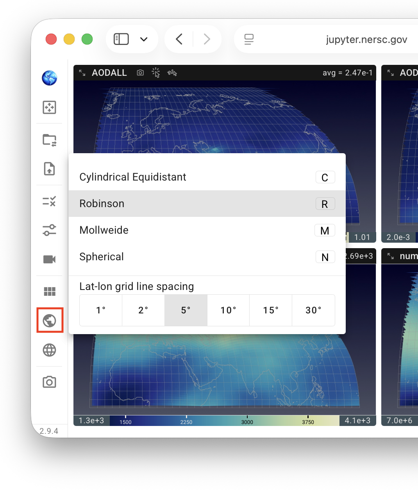
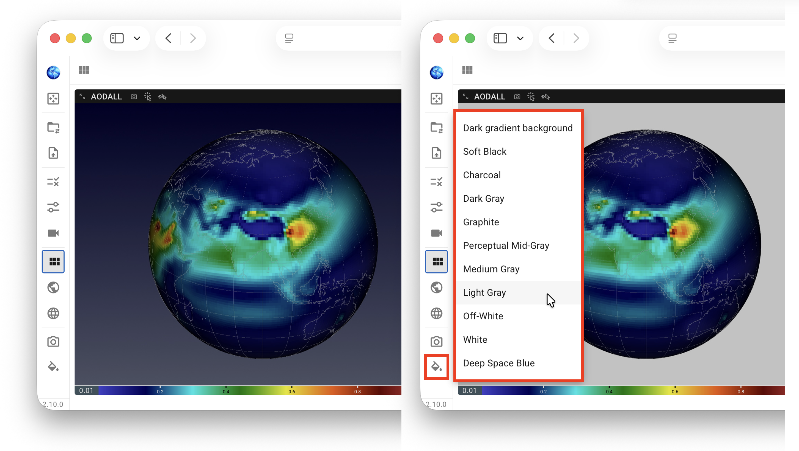
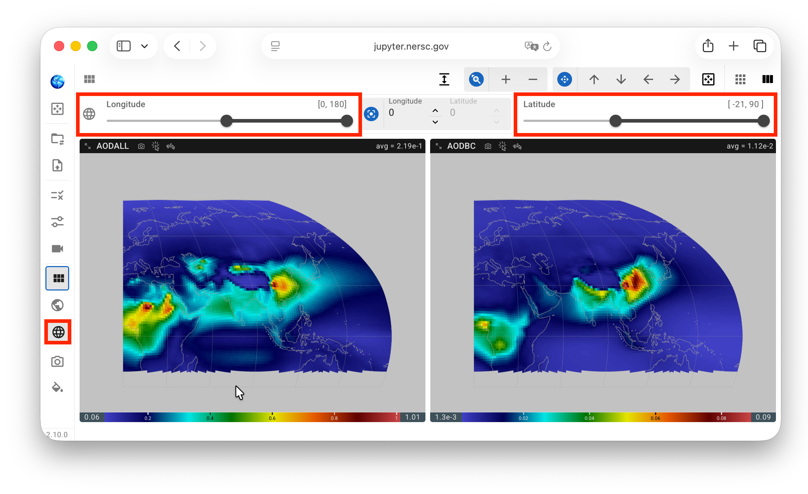
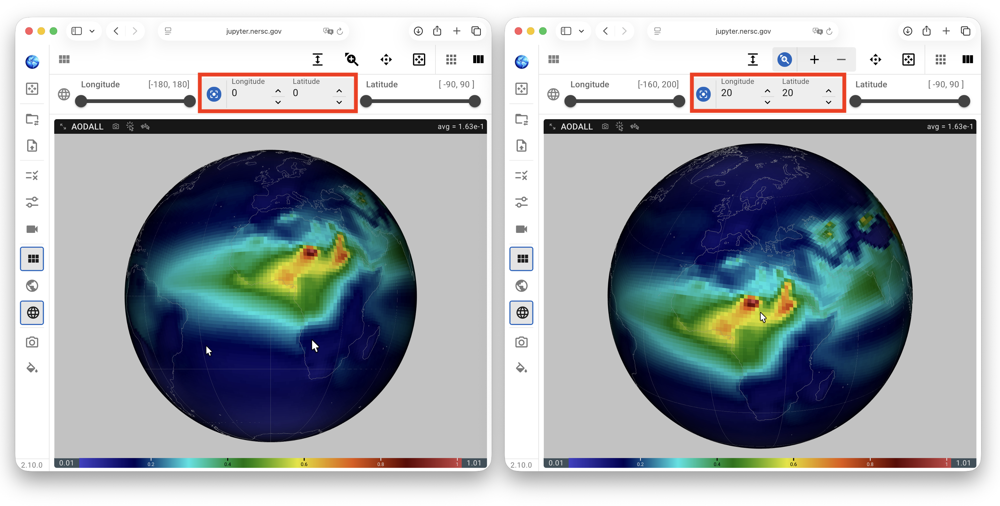
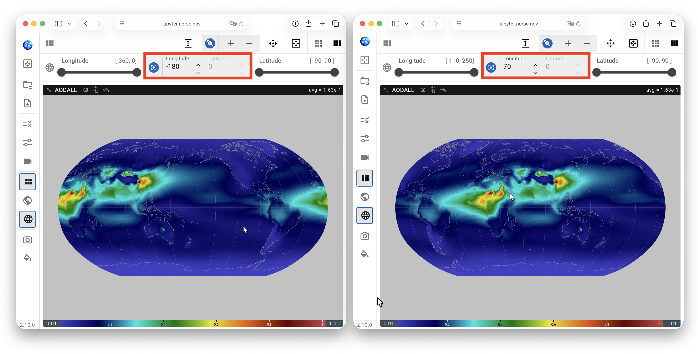

# Map-Related Features

[[toc]]

## Map projection {#map-projections}

{ width="60%", align=right }

The map projection used for the contour plots can be changed through the mini-menu opened by clicking the Earth icon in the vertical toolbar. The projection can also be selected using the following keyboard shortcuts:

- `C`: cylindrical equidistant;
- `R`: Robinson;
- `M`: Mollweide;
- `N`: spherical.

The bottom section of the same mini-menu allows the user to adjust the spacing of the latitude–longitude grid lines shown on the map.

## Plot background color {#plot-background-color}

QuickView uses ParaView's "dark gradient" as the default plot background.
Depending on the map projection and colormap, however, a different background
color may improve visual contrast. For example, with the spherical projection,
a lighter background can make the boundary of the globe easier to distinguish.
For other projections, changing the background may help distinguish regions
whose data colors are similar to the default background.

Starting in version 2.10.0, the plot background color can be changed through
the mini-menu opened by clicking the background-color icon in the vertical toolbar.

{ width="100%" }

## Geographical region {#geographical-region}

The geographical region displayed in the contour plots—defined by its latitude
and longitude bounds—can be adjusted using the range sliders in the
latitude–longitude cropping panel. The panel is opened by clicking the Earth-grid
icon in the vertical toolbar.

On each slider, the full available range is shown in gray, while the range
being displayed is shown in black and reported numerically above the slider.

{ width="100%" }

## Map center {#map-center}

The controls between the latitude and longitude range sliders allow the user
to specify the **"map center"**:

- With the **spherical projection**, QuickView rotates the globe so that the
  specified geographical location (longitude and latitude) faces the viewer
  and appears at the center of the visible globe. The UI therefore allows
  both its longitude and latitude to be adjusted.

  { width="100%" }

- For the **cylindrical equidistant, Robinson, and Mollweide projections**,
  the projection remains centered on the equator. The center-*latitude* control
  is therefore grayed out, but the user can still specify a *longitude* for
  the center of the map presented to the viewer.

  { width="100%" }

When the center longitude is changed, the full available range of the longitude
slider automatically adjusts to span 180° west and east of the new center
longitude. The latitude slider always spans from 90°S to 90°N.
