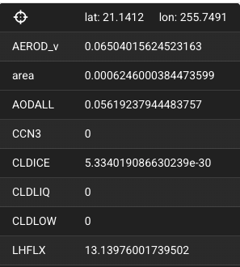
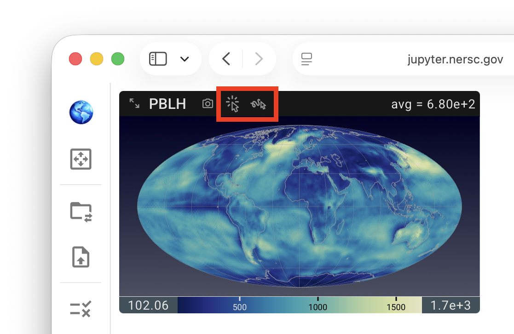
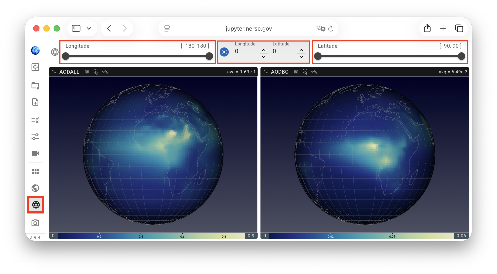
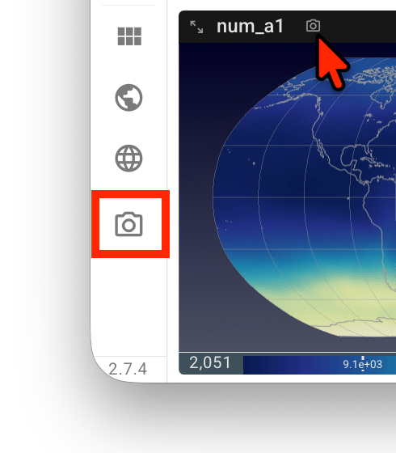
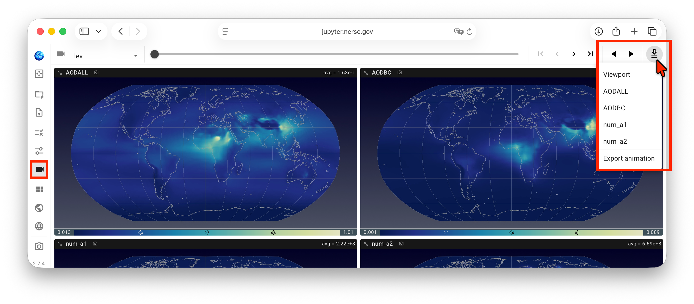

# Miscellaneous Features 

QuickView includes various convenient features tailored to Earth system modelers' analysis workflow.

[[toc]]

## Cursor probe {#cursor-probe}

Starting in version 2.8.3, QuickView provides a Cursor Probe for inspecting data values at the cursor location. Two modes are available:

| Icon | Mode | Description |
|------|------|-------------|
|  | Hover Mode | Updates continuously as the cursor moves over contour plots in the viewport. |
|  | Click Mode | Updates only when the user clicks a location in a contour plot. This mode may provide better responsiveness when working with very large datasets. |

{ width="40%", align=right }

In both modes, information associated with the cursor location is displayed in
an *Information Panel*, as shown in the screenshot here.
The latitude and longitude of the cursor location are shown at the top,
followed by the name and value of the variable in the current view, as well as
the names and values of the other variables displayed in the viewport.
If a variable has non-horizontal dimensions, the value shown in the Information Panel
is the value at the cursor-selected lat-lon location in the currently data slice. 

{ width="50%", align=right }

The Cursor Probe is inactive by default and can be activated by clicking either the
Hover Mode or Click Mode icon in any viewport panel.
These icons are available in all views for convenient access.
However, the probe's activate/inactive state applies to the entire viewport
and is shared across all views. As a result, the Cursor Probe cannot be enabled
for some views (variables) while remaining disabled for others.

## Choosing map projection and geographical region {#maps}

The map projection used for the contour plots can be changed using the mini menu
activated by a click on the Earth icon in the vertical tool bar—or by keyboard shortcuts:

- `C` for cylindrical equidistant,
- `R` for Robinson, and
- `M` for Mollweide.

The geographical region, i.e., the latitude and longitude bounds to be displayed in the contour plots,
can be adjusted using the sliders in the lat/lon cropping panel activated by a click on
the Earth grid icon in the vertical toolbar.

{ width="90%" }

## Saving the visualization {#save-vis}

In addition to [saving the state](/guides/quickview/file_selection#state-files)
of the current session so that the analysis can be resumed later,
QuickView provides three ways for the user to save the visualization as images
or animations for presentations and manuscripts, etc.:

{ width="30%", align=right }

- A click on the **camera icon** at the end of the vertical **toolbar** saves the entire
  viewport—in its current layout—to the local computer as `Viewport.png`.

- A click on the **camera icon** next to the variable name **inside a view panel**
  saves that single view as a `.png` file. The file name starts with the variable name;
  dimension names and indices are appended when relevant.
  For example, `aero_tau_sw-lev-71-swband-00.png` is an image of variable `aero_tau_sw`
  at `lev` index 71 and `swband` index 0.

- Let us assume the user has been inspecting 4 variables along the `lev` dimension,
  as depicted by the screenshot here. To export animations showing how these variables
  change in that dimension, the user can click on the icon on the right end of the
  animation control panel, i.e., the downward arrow with two lines,
  to bring up a drop-down menu and then click to select
  `Viewport` and/or individual variables. Subsequently, a click on `Export animation`
  triggers QuickView to scan through the indices in the `lev` dimension,
  with a dark-red circle spinning around the download button while the scan is in progress.
  After the scan is finished, a file `quickview-animation.zip` gets downloaded to the local computer.
  This file is a zipped folder that may contain multiple files.

{ width="90%" }

Note: as of version 2.6.1, the animation export downloads
images of individual frames to the local computer, and the user needs to use a tool to combine
the images into an animation (or animations).
Direct download of animation files will be provided soon.

{ width="10%", align=right }

If the user clicks the animation download button again while the dark-red circle is still
spinning, the click will end the scan. A `.zip` file will still be downloaded and
will contain images from index 0 to the last index that QuickView has scanned.
