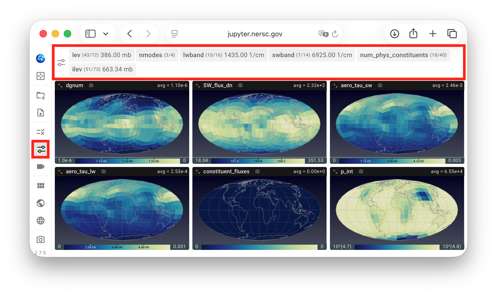
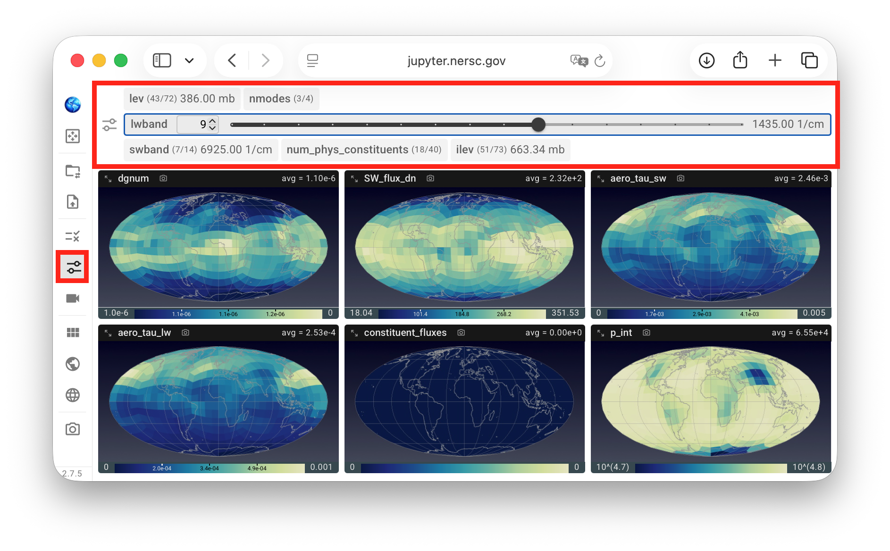
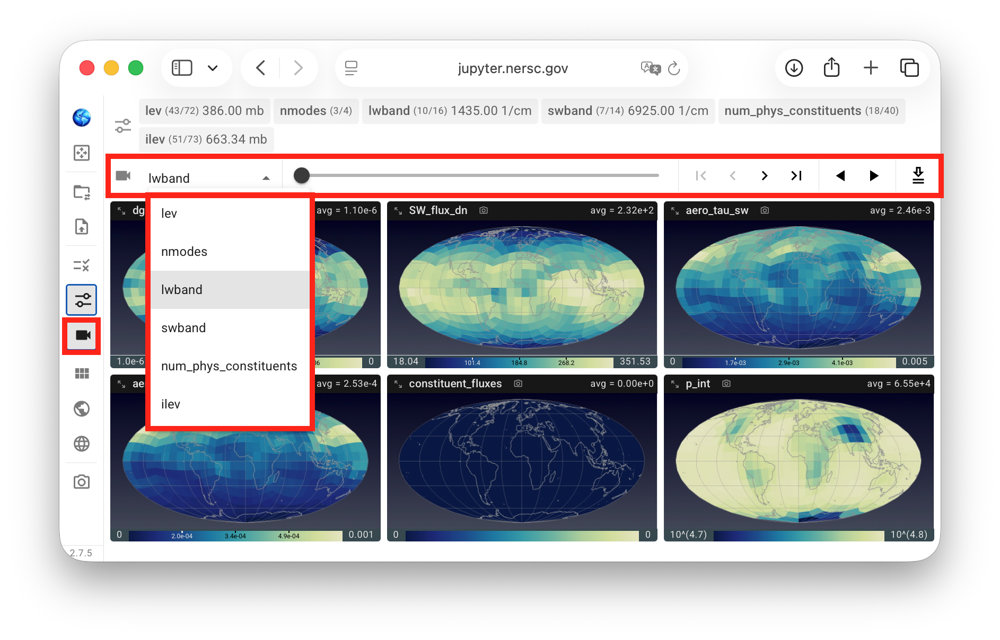

# Selecting Data Slices to Inspect

QuickView is designed to visualize variables in the simulation data files
that have horizontal dimensions representing the globe.
The variables are shown on global or regional maps.
If a variable has additional dimensions such as time, vertical level, etc.,
QuickView is designed to display one global or regional map at a time for that variable.

To choose the indices to inspect for the non-horizontal dimensions,
the slice selection button in the vertical toolbar can be clicked
to bring up the **slice selection control panel**, as shown in
the first screenshot below.

In this example, the selected variables together have six non-horizontal dimensions
with more than one data slice in the simulation file,
corresponding to the six gray tabs highlighted in the red box.
Inside each tab, the dimension name is shown in bold, and
the current and total number of data slices are shown in parenthesis.
When a dimension has an associated 1D dimension variable,
its current value and unit are also displayed.

{ width="100%" }

A click on a gray tab changes it into an expanded mode,
revealing a textbox, a pair of up and down buttons, as well as
a slider for changing the slice along that dimension.
A click on an expanded tab changes it back to a compact mode.

{ width="100%" }

Alternatively, the **animation control panel** shown in the screenshot below
can be used. This panel contains a drop-down menu for choosing a dimension to inspect,
a slider and a set of forward and backward buttons for manually stepping through the selected dimension,
as well as a two play/pause toggles for automatically stepping through the selected dimension
in forward or backward order.
The rightmost button in the panel, showing a downward arrow above two horizontal lines,
is for exporting animations and is explained on [a separate page](./miscellaneous#save-vis)

{ width="100%" }
