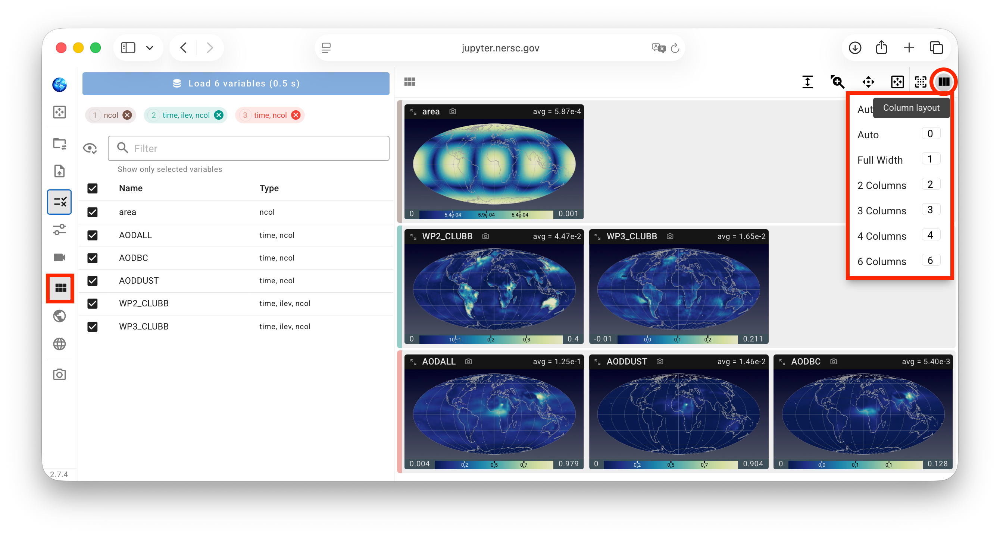
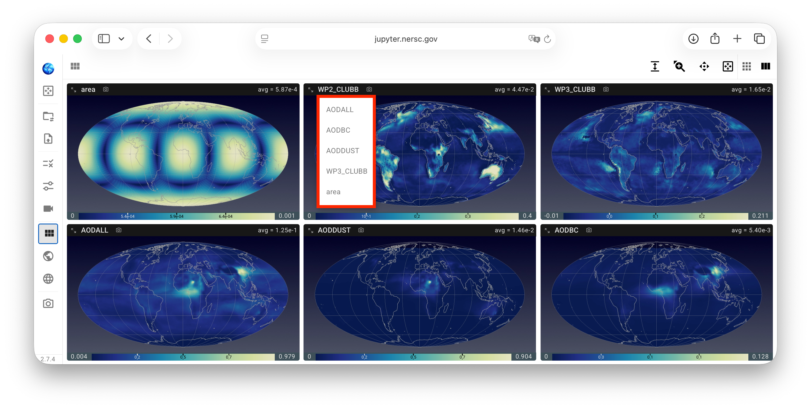
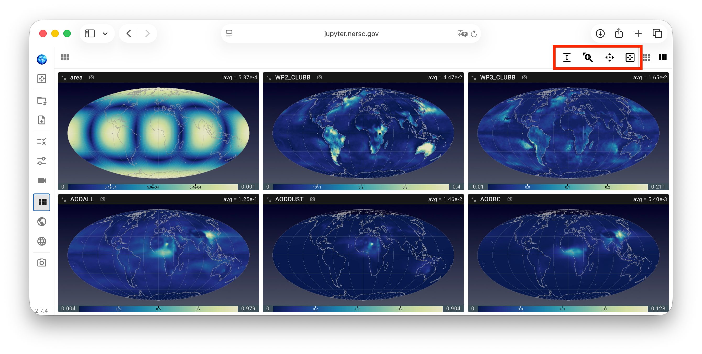
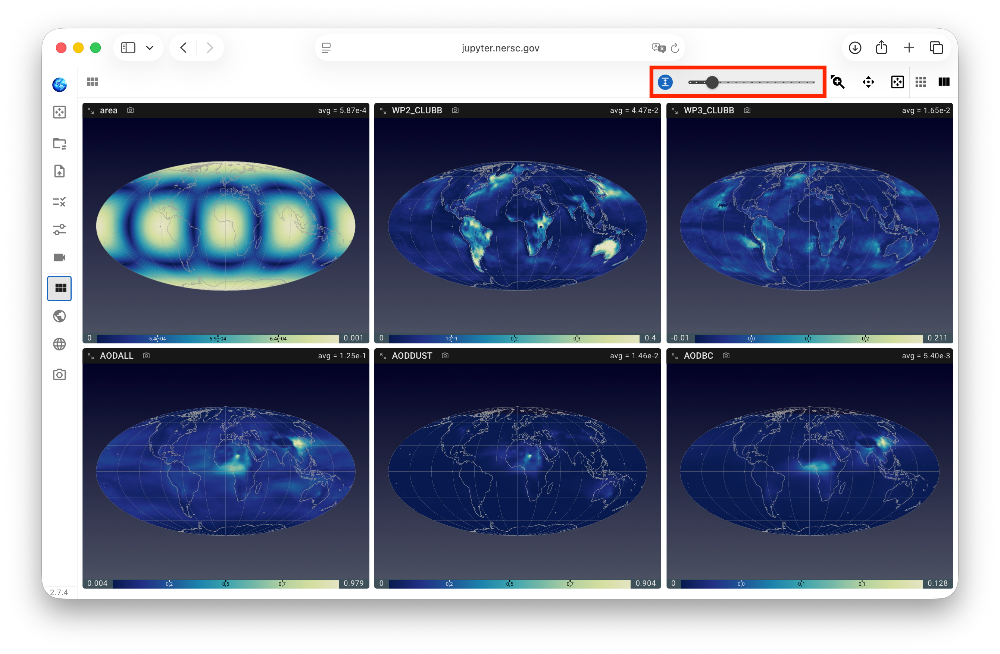
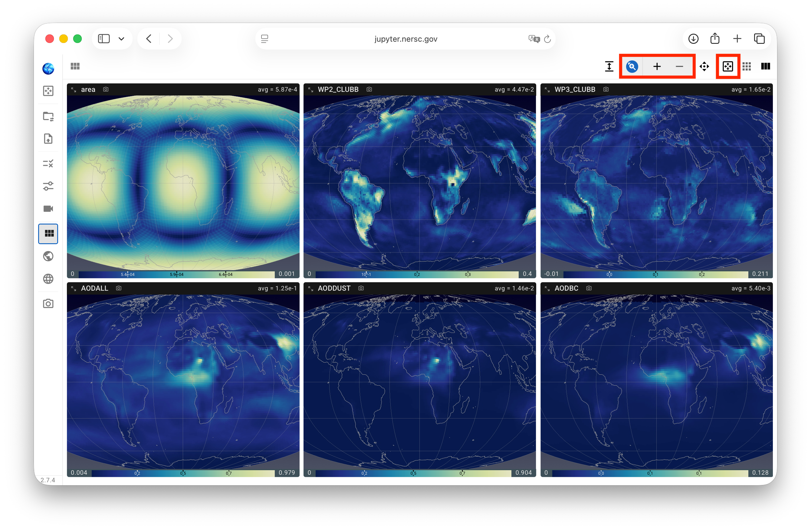
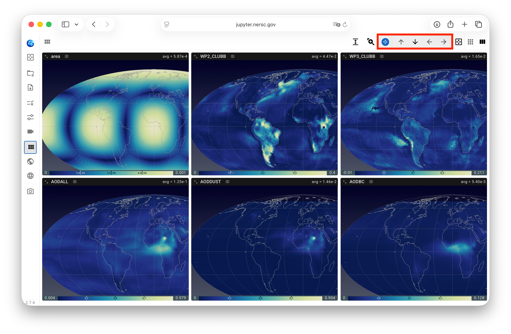

# Customizing Viewport Layout

::: tip Tip for users of QuickView version 1
QuickView version 1 allowed the user to change the sizes and locations
of different contour plots in the viewport by drag-and-drop.
Users' feedback indicated that arbitrary drag-and-drop can get confusing,
and it was inconvenient to not have a way to reapply the same size to all views.
With these comments in mind, we have changed the mechanisms for
configuring the viewport in version 2.
:::

## View size

QuickView version 2 supports showing 1, 2, 3, 4, or 6 columns of views (contour plots)
in the view port. The number of columns can be changed by pressing the corresponding
number keys on the keyboard or using the viewport layout control panel,
via the "Column layout" menu
on the right of that panel, as shown in the screenshot below.
The viewport is evenly divided into the selected number of columns.
When the user changes the width of their browser window,
the individual views are automatically readjusted.

{ width="100%", align=center }

## Grouped or ungrouped views

If the selected variables have different shapes, the contour plots are grouped by shape by default.
Each group is identified by a vertical bar on the left side of the viewport,
shown in the same color as the corresponding group tab in
the [variable selection](./variable_selection) control panel.
The screenshot above shows three variable groups.

{ width="12%", align=right }

This grouping in the viewport can be canceled (or reapplied) by using
the `G` key or a "Grouped" versus "Ungrouped" toggle.

## Sequence of variables in the viewport

In the top-left corner of each individual view, the variable name is shown.
A click on the text activates a drop-down menu for the user to replace
the current variable by a different one, resulting in the corresponding views
to swap contents.

- When the plots in the viewport are ungrouped, the drop-down menu 
  lists all the other variables that have been loaded. See example
  in the screenshot below.
- When the plots in the viewport are grouped, the drop-down menu
  lists all the other loaded variables *in the same group* that
  the user can choose from.

{ width="100%", align=center }

## Additional adjustments

The viewport layout control panel has a few other toggles that, upon click,
reveal additional sliders or buttons for simultaneously
adjusting all views in the viewport, as shown in the screenshot below
and explained in more detail in the subsequent subsections.

{ width="100%", align=center }

### Aspect ratio of view frame

A slider is provided for adjusting the aspect ratio of the view frames by changing their heights.
This can be useful for controlling the blank spaces, especially for
[regional plots](./miscellaneous#maps).

{ width="100%", align=center }

### Plot size relative to view frame

A pair of zoom-in and zoom-out buttons are provided for changing the plot sizes
with respect to the view frames. A click on the auto-zoom button resets the sizes to fit the frames.

When (and only when) the zoom-in/zoom-out button group is expanded, the keyboard combinations
`shift + ↑` and `shift + ↓` can be used as shortcuts for zooming in and out, respectively.

{ width="100%", align=center }

### Plot location inside view frame

A set of four buttons is provided for moving the plots left, right, up, or down
with respect to the view frames, an operation commonly referred to as panning in graphical user interfaces.
When (and only when) the pan menu is expanded as shown in the screenshot below, the four arrow keys on
the keyboard can also be used for panning.

{ width="100%", align=center }
