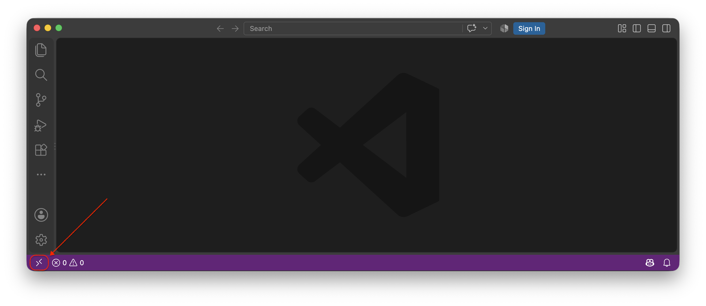
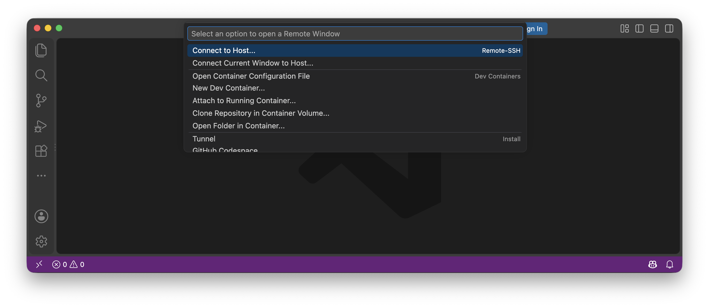
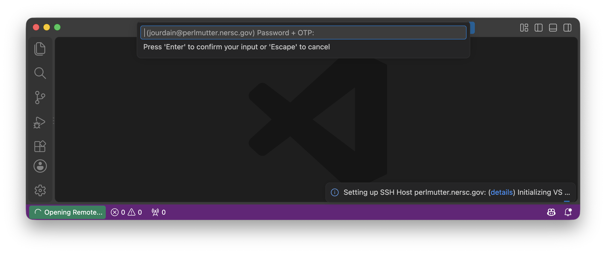
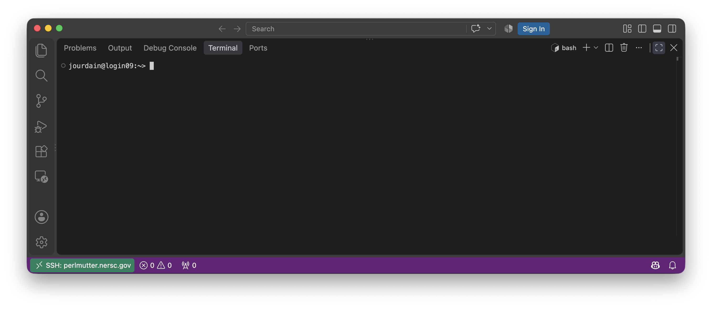
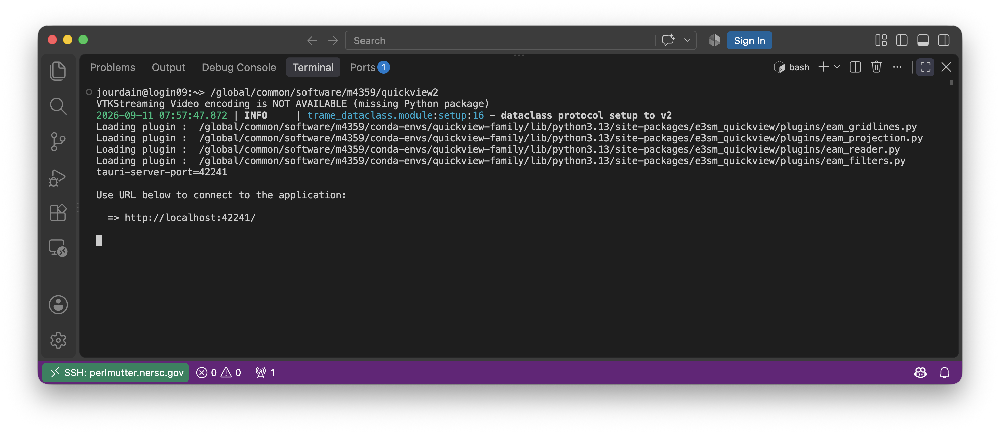
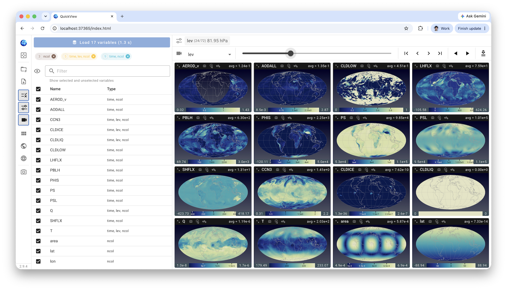

# NERSC Connection via VSCode

In order to use VSCode to start QuickView at NERSC, you first need to connect via SSH using VSCode into Perlmutter.

For connecting to perlmutter at NERSC you need to use `<username>@perlmutter.nersc.gov` as hostname and for your password, you will need to concatenate your `<password>` with your `<OTP-code>` like `<password><OTP-code>`.

When opening VSCode locally you should ask to `Connect to Host...` by clicking on the bottom-left corner button.

Once you have your terminal available inside VSCode, you can start any Quick Family executable like you would using JupyterLab.

When running the QuickView executable, the URL display will be `localhost` and will work within VSCode web viewer or your standard browser like shown below.

